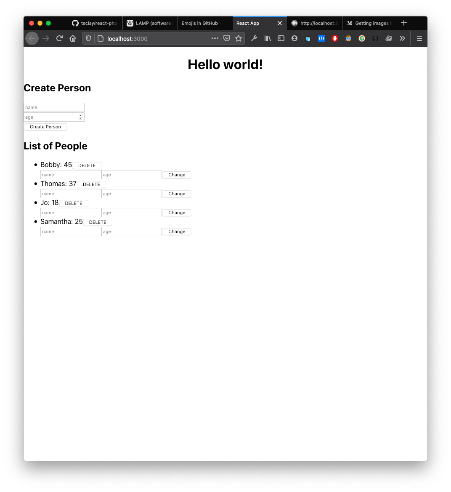

# :elephant: RAPP :elephant:

This is a template for a project using the following tech stack:

- React for front-end UI
- Apache for web server
- PostgreSQL for database
- PHP for server language

**This guide will not discuss how to use React, PHP, LAMP/MAMP, PostgreSQL, and Apache outside of congifuration.**

## :computer: Database Setup :computer:

First, make sure PostgreSQL is installed on your machine. If it's not, install it [here](https://www.postgresql.org/download/).

Start up the database server. The command for this may differ based on your configuration. Refer to [these docs](https://www.postgresql.org/docs/9.1/server-start.html).

```bash
postgres -D /usr/local/var/postgres/
```

In a separate tab, run the seed file that will create a database called "contacts", connect to it, create a "people" table, and populate it. Run this command from inside the project root; otherwise, you'll need to type the absolute path to the seed file.

```bash
$: psql -f API/models/seed.sql
> DROP DATABASE
> CREATE DATABASE
> You are now connected to database "contacts" as user "YourUserName".
> CREATE TABLE
> INSERT 0 4
```

## :satellite: Pointing the MAMP server :satellite:

Go to your MAMP preferences and change the directory for the server to the public directory inside the project root.

## :rocket: Setup React :rocket:

Test that the React front-end builds successfully by compiling all its code and firing up a development server to host it.
```bash
npm run start
```

It should look something like this:



